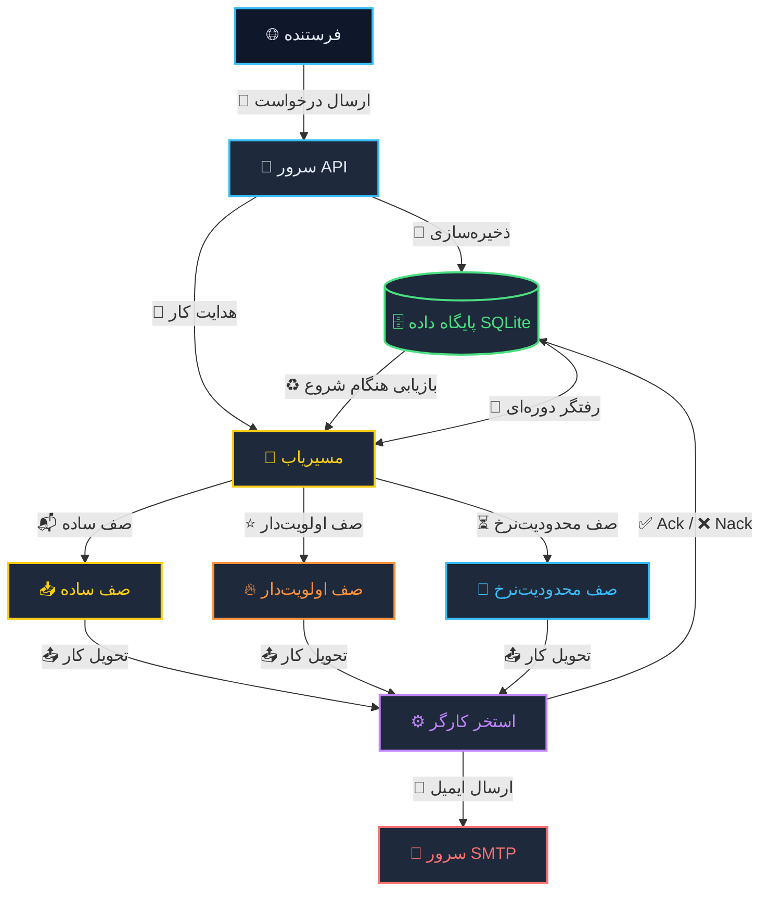

# مستندات فنی پروژه Job Queue

## ۱. معرفی

این پروژه یک Job Queue مقاوم در برابر خطا برای ارسال ایمیل‌های انبوه است.  
زبان پیاده‌سازی آن Go است و هدف اصلی آن تضمین انجام تمام کارها حتی در صورت خرابی سرور، قطع شبکه یا پایان یافتن تلاش‌های مجدد می‌باشد.

کارها از طریق یک REST API دریافت می‌شوند، ابتدا در SQLite ذخیره می‌گردند و سپس توسط چندین Worker هم‌روند پردازش می‌شوند.  
در صورت بروز خطا، سیستم به صورت خودکار کار شکست‌خورده را دوباره تلاش می‌کند و هیچ کاری از بین نمی‌رود.

**ویژگی‌های اصلی:**

- پذیرش کار از طریق REST
- ذخیره‌سازی پایدار در SQLite
- پردازش هم‌روند با Worker Pool
- تلاش مجدد خودکار
- بازیابی کارهای ناتمام هنگام راه‌اندازی
- رفتگر دوره‌ای برای کارهای سرگردان
- سه نوع صف: FIFO، اولویت‌دار و Rate-Limited
- پیش‌دستی برای کارهای فوق‌العاده
- داشبورد زنده با به‌روزرسانی دوثانیه‌ای

---

## ۲. معماری کلی

سیستم از چند لایه مستقل تشکیل شده است.  
درخواست‌ها از سمت Client دریافت می‌شوند، اعتبارسنجی می‌شوند و به صف مناسب هدایت می‌شوند. Workerها به طور پیوسته از صف‌ها کار دریافت می‌کنند و آن را اجرا می‌کنند.



**اجزای اصلی:**

- **لایه دریافت درخواست:** دریافت درخواست‌های HTTP و تبدیل آن‌ها به ساختار Job.
- **Router:** هدایت هر کار به صف متناسب با نوع صف.
- **صف‌ها:** سه صف با رفتارهای گوناگون.
- **وورکر پول (Worker Pool):** مجموعه‌ای از Goroutineها برای پردازش کارها.
- **پایگاه داده SQLite:** منبع اصلی ثبت وضعیت تمام کارها.

---

## ۳. چرخه زندگی یک کار

۱. درخواستی از نوع POST به مسیر `/jobs` همراه با بدنه JSON شامل گیرنده، موضوع، متن، نوع صف و اولویت دریافت می‌شود.

۲. یک نمونه Job با شناسه یکتای UUID ساخته می‌شود و وضعیت آن pending قرار می‌گیرد.

۳. کار در SQLite ذخیره می‌شود.

۴. کار از طریق Router به کانال صف مربوطه وارد می‌شود.

۵. یکی از Workerها کار را از کانال برداشته و وضعیت آن را به processing تغییر می‌دهد.

۶. ایمیل از طریق SMTP ارسال می‌شود:

- **موفقیت:** وضعیت کار completed ثبت می‌شود.
- **شکست:** شمارنده Retry افزایش می‌یابد. اگر کمتر از حد مجاز باشد، کار دوباره به صف برمی‌گردد. در غیر این صورت failed می‌شود.
- **پیش‌دستی:** اگر کار فوق‌العاده وارد شود و همه Workerها مشغول باشند، یک کار معمولی لغو شده و بدون جریمه به صف بازمی‌گردد.

---

## ۴. انواع صف‌ها

### ۴.۱ صف ساده

این صف بر اساس ترتیب ورود کارها عمل می‌کند.  
هر کاری که زودتر وارد شود، زودتر پردازش می‌شود.  
برای کارهای معمولی مانند ارسال خبرنامه مناسب است.

### ۴.۲ صف اولویت‌دار

این صف برای کارهایی ساخته شده که ترتیب پردازش آن‌ها بر اساس اهمیتشان مشخص می‌شود، نه زمان ورودشان.

هر کار هنگام ورود، یک عدد priority می‌گیرد.  
هرچه این عدد بالاتر باشد، کار زودتر پردازش می‌شود.

سه سطح اولویت وجود دارد:

- **معمولی:** کارهای عادی مثل ارسال خبرنامه.
- **فوری:** کارهایی که باید زودتر انجام شوند، مثل ایمیل تأیید حساب.
- **فوق‌العاده:** کارهایی که باید همان لحظه پردازش شوند، مثل هشدار امنیتی.

اگر کارهای معمولی در صف باشند و یک کار فوری وارد شود، کار فوری از همه جلو می‌زند.

اگر یک کار فوق‌العاده وارد شود و همه Workerها مشغول پردازش کارهای معمولی باشند، سیستم یک کار معمولی را متوقف می‌کند تا کار فوق‌العاده همان لحظه پردازش شود.

به این رفتار preemption گفته می‌شود.

کار معمولی که متوقف می‌شود، از بین نمی‌رود.  
دوباره به صف برمی‌گردد و شمارنده تلاش آن هم افزایش پیدا نمی‌کند.

این صف نشان می‌دهد که در سیستم‌های واقعی، بعضی کارها واقعاً مهم‌تر از بقیه‌اند و نباید پشت کارهای کم‌اهمیت منتظر بمانند.

### نمونه‌ای از پیاده‌سازی Preemption

در Worker Pool، وقتی یک کار فوق‌العاده وارد می‌شود، تابع زیر اجرا می‌شود:

```go
func (p *Pool) Preempt(job *models.Job) (string, error) {
    p.mu.Lock()
    defer p.mu.Unlock()

    for i, w := range p.workers {
        if w.currentJob != nil && w.currentJob.Priority == models.PriorityNormal {
            preemptedID := w.currentJob.ID
            w.cancel()
            p.preemptQueue[i] = job
            return preemptedID, nil
        }
    }

    return "", fmt.Errorf("no preemptable job found")
}
```

این تابع یک Worker را که مشغول کار معمولی است پیدا می‌کند، آن را لغو می‌کند و کار فوق‌العاده را جای آن قرار می‌دهد.

### ۴.۳ صف Rate-Limited

این صف برای کنترل سرعت پردازش طراحی شده است.  
با استفاده از الگوریتم Token Bucket، نرخ خروجی کارها محدود می‌شود.

هر کار برای پردازش به یک token نیاز دارد. Tokenها با نرخ مشخص دوباره پر می‌شوند.  
این روش برای رعایت محدودیت‌های سرویس‌دهنده ایمیل کاربرد دارد.

---

## ۵. اجزای فنی

### ۵.۱ مدل داده Job

فایل: `pkg/models/job.go`

```go
type Job struct {
    ID          string     `json:"id"`
    ToEmail     string     `json:"to"`
    Subject     string     `json:"subject"`
    Body        string     `json:"body"`
    QueueType   string     `json:"queue"`
    Priority    int        `json:"priority"`
    Status      string     `json:"status"`
    RetryCount  int        `json:"retry_count"`
    MaxRetries  int        `json:"max_retries"`
    CreatedAt   time.Time  `json:"created_at"`
    UpdatedAt   time.Time  `json:"updated_at"`
    ProcessedAt *time.Time `json:"processed_at,omitempty"`
    ErrorMessage string    `json:"error_message,omitempty"`
}
```

- فیلد `ProcessedAt` اشاره‌گر است تا در صورت پردازش نشدن کار، در خروجی JSON نمایش داده نشود.

### ۵.۲ لایه ذخیره‌سازی

اینترفیس `Storage` در مسیر `internal/storage/interface.go` عملیات پایگاه داده را تعریف می‌کند.  
پیاده‌سازی SQLite در `internal/storage/sqlite.go` انجام شده است.

نکات مهم:

- تنظیم `SetMaxOpenConns(1)` برای جلوگیری از خطای قفل فایل.
- استفاده از `sql.NullTime` و `sql.NullString` برای مدیریت ستون‌های NULL.

### ۵.۳ صف حافظه‌ای

```go
type MemoryQueue struct {
    store  storage.Storage
    jobs   chan *models.Job
    mu     sync.Mutex
    wg     sync.WaitGroup
    closed bool
    done   chan struct{}
}
```

- **افزودن به صف:** با استفاده از `select` روی کانال `jobs` و `done` از panic جلوگیری می‌کند.
- **بستن صف:** ابتدا کانال `done` بسته می‌شود، سپس با `wg.Wait()` منتظر پایان ارسال‌ها می‌مانیم و در نهایت کانال `jobs` بسته می‌شود.
- **بازیابی:** هنگام راه‌اندازی، کارهای pending و processing را به صف برمی‌گرداند.
- **رفتگر:** هر ۵ دقیقه کارهای سرگردان را شناسایی و دوباره صف می‌کند.

### ۵.۴ صف Rate-Limited

```go
type RateLimitedQueue struct {
    *MemoryQueue
    rate       int
    burst      int
    tokens     int
    mu         sync.Mutex
    stopRefill chan struct{}
}
```

- یک Goroutine پس‌زمینه توکن‌ها را با نرخ مشخص اضافه می‌کند.
- متد `Dequeue` ابتدا کار را از صف می‌گیرد و سپس منتظر توکن می‌ماند.
- متد `Enqueue` از نسخه امن MemoryQueue استفاده می‌کند.

### ۵.۵ Router

```go
type Router struct {
    FIFO        *MemoryQueue
    Priority    *MemoryQueue
    RateLimited *RateLimitedQueue
}
```

- **متد Enqueue:** کار را بر اساس نوع صف هدایت می‌کند.
- **متد Dequeue:** اولویت برداشت: صف اولویت‌دار، سپس Rate-Limited و در نهایت FIFO.

### ۵.۶ Worker Pool

```go
type Pool struct {
    queue        queue.Queue
    processor    Processor
    count        int
    timeout      time.Duration
    cooldown     time.Duration
    wg           sync.WaitGroup
    mu           sync.Mutex
    workers      []*workerState
    preemptQueue []*models.Job
}
```

**روال هر Worker:**

- ابتدا بررسی می‌کند که آیا کار فوق‌العاده‌ای رزرو شده است.
- در غیر این صورت از صف کار دریافت می‌کند.
- وضعیت کار را در پایگاه داده به‌روز می‌کند.
- یک context با مهلت زمانی می‌سازد.
- تابع پردازش را صدا می‌زند.
- بر اساس نتیجه یکی از توابع Ack، Nack یا Requeue را فراخوانی می‌کند.

**پیش‌دستی:**  
هنگام ورود کار فوق‌العاده، متد `Preempt` یک Worker معمولی را یافته و متوقف می‌کند.  
کار متوقف‌شده بدون جریمه به صف بازمی‌گردد.

هر Worker با `defer recover` از فروپاشی کل استخر جلوگیری می‌کند.

### ۵.۷ API

- `POST /jobs` — ایجاد کار جدید
- `GET /jobs/{id}` — دریافت اطلاعات کار
- `GET /jobs` — دریافت آخرین کارها
- `GET /stats` — دریافت آمار
- `GET /processing` — کارهای در حال پردازش
- `GET /pending` — کارهای در صف
- `GET /health` — بررسی سلامت
- `POST /jobs/{id}/retry` — تلاش مجدد برای کار شکست‌خورده

### ۵.۸ داشبورد

داشبورد در فایل `dashboard.html` قرار دارد و در باینری نهایی embed می‌شود.  
هر ۲ ثانیه داده‌ها از API دریافت و به‌روزرسانی می‌شوند.

- کارت‌های Worker به صورت درجا به‌روزرسانی می‌شوند.
- وضعیت‌ها با Spinner، چک‌مارک سبز و ضربدر قرمز نمایش داده می‌شوند.
- سه ستون مجزا برای صف‌ها وجود دارد.
- نوار توکن برای صف Rate-Limited نمایش داده می‌شود.
- دکمه Retry در کنار کارهای شکست‌خورده قرار دارد.

---

## ۶. چالش‌های هم‌روندی

### ۶.۱ جلوگیری از Deadlock و panic هنگام بستن صف

**نسخه اولیه:**

```go
q.jobs <- job
```

این روش در صورت بسته بودن کانال باعث panic می‌شد.

**نسخه نهایی:**

```go
select {
case q.jobs <- job:
    return nil
case <-q.done:
    return fmt.Errorf("queue is closing")
}
```

در متد `Close` ابتدا کانال `done` بسته می‌شود، سپس با `wg.Wait()` منتظر پایان ارسال‌ها می‌مانیم و در نهایت کانال `jobs` بسته می‌شود.

### ۶.۲ رفع Race Condition در صف Rate-Limited

در نسخه اولیه، متد `Enqueue` جداگانه پیاده‌سازی شده بود و با mutex نادرست به `closed` دسترسی پیدا می‌کرد.  
این موضوع باعث data race می‌شد.

راه‌حل: حذف بازنویسی `Enqueue` و استفاده از نسخه امن MemoryQueue.

---

## ۷. مقاومت در برابر خطا

- **خطای SMTP:** کار سه بار تلاش مجدد می‌شود و سپس failed می‌شود.
- **قطعی سرور:** کارها در SQLite باقی می‌مانند و هنگام راه‌اندازی به صف بازمی‌گردند.
- **Timeout:** هر کار مهلت زمانی مشخصی دارد.
- **کار سرگردان:** رفتگر هر ۵ دقیقه آن را شناسایی و دوباره صف می‌کند.
- **کار گیر کرده:** رفتگر کارهای processing طولانی‌مدت را بازنشانی می‌کند.

---

## ۸. پیکربندی

فایل `config.yaml`:

```yaml
server:
  port: 8080

queue:
  workers: 5
  demo_delay_seconds: 5
  cooldown_seconds: 1

email:
  smtp_host: "smtp.gmail.com"
  smtp_port: 587
  smtp_user: ""
  smtp_pass: ""

retry:
  max_attempts: 3
  backoff_seconds: 5

timeout:
  job_seconds: 30

rate_limit:
  emails_per_minute: 6
  burst: 3
```

مقادیر را می‌توان با متغیرهای محیطی با پیشوند `RJQ_` بازنویسی کرد.

---

## ۹. اجرا و آزمایش

**راه‌اندازی با Docker:**

```bash
docker compose up -d --build
```

**ارسال یک کار نمونه صف ساده :**

```bash
curl -X POST http://localhost:8080/jobs \
  -H "Content-Type: application/json" \
  -d '{"to":"test@test.com","subject":"Test","body":"Hello","queue":"fifo"}'
```

**ارسال یک کار نمونه با صف اولویت‌دار :**

```bash
curl -X POST http://localhost:8080/jobs \
  -H "Content-Type: application/json" \
  -d '{"to":"urgent@test.com","subject":"Urgent Test","body":"Hello","queue":"priority","priority":2}'
```

‍‍
**ارسال یک کار نمونه با صف محدودیت‌نرخ :**

```bash
curl -X POST http://localhost:8080/jobs \
  -H "Content-Type: application/json" \
  -d '{"to":"rate@test.com","subject":"Rate Test","body":"Hello","queue":"rate-limited"}'
```

‍‍

**اسکریپت‌های تست:**

- `priority-demo.sh` برای نمایش اولویت و پیش‌دستی
- `failure-demo.sh` برای نمایش خطا و بازیابی

داشبورد در نشانی `http://localhost:8080/dashboard` در دسترس است.
